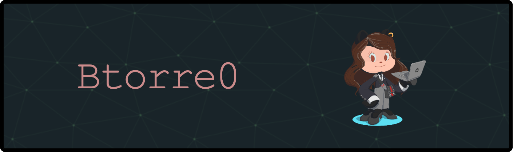

₊˚⊹♡ ₊˚⊹♡ ₊˚⊹♡

### About Me

Hello World! My name is Beatriz Torres, and I was born and raised in Sonoma.  
I’m currently an undergraduate at CSUF majoring in Computer Science.

- I’m based in the United States
- You can contact me at [btorre0@csu.fullerton.edu](mailto:btorre0@csu.fullerton.edu)
- I’m currently learning Unity, Godot, Node.js, Unreal Engine, and PyTorch
- I’m open to collaborating on AI & Machine Learning Projects, Game Dev., Web Dev., Full-Stack, Open Source Contributions, and Systems Programming

 

### ₊˚⊹♡ Tech Stack

  

 

### ₊˚⊹♡ Currently Learning

  

 

### ₊˚⊹♡ Connect With Me

  
  
  

 

₊˚⊹♡ thanks for visiting ♡⊹˚₊

